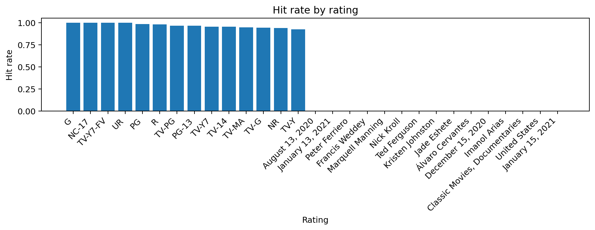

# 📊 StreamSense — Hit Predictor Demo

This notebook provides the final, demo-ready stage of the **StreamSense** pipeline — showcasing how a trained Machine Learning model can predict whether a Netflix title is likely to become a *hit*, based purely on metadata.

It also includes supporting visual insights, feature importance analysis, and reusable Delta tables for dashboarding.

---

## 🎯 Objective

Demonstrate the StreamSense Random Forest model through:

- Interactive **What-If** predictions  
- Hit-rate analytics (category, rating, release year)  
- Feature importance visualisation  
- Model loading + inference pipeline using MLflow  

This notebook represents the final part of the project workflow:

1. **Data ingestion**  
2. **Feature engineering**  
3. **Model training & MLflow tracking**  
4. **Hit predictor demo** ← *this notebook*

---

## 📁 Notebook Contents

### 1. Load Cleaned Dataset  
Loads `netflix_clean` (Delta table) created earlier in the pipeline and previews schema + sample rows.

---

### 2. Load Latest MLflow Model  
Retrieves the **most recent run** from the StreamSense experiment and loads the stored model via:
```
runs:/<latest_run_id>/model
```
Ensures reproducibility and traceability.

---

### 3. 🔮 What-If Prediction Helper

Allows users to test hypothetical titles by specifying:

- Category  
- Rating  
- Release year  
- Duration  
- Movie vs TV  
- Country  

Returns:

- **Predicted hit probability**  
- **Predicted class (HIT / NON-HIT)**  

Perfect for demos, dashboards, or UI integration.

---

### 4. 📈 Visual Exploration

Breaks down hit-rate patterns across:

- **Category** (Movie vs TV Show)  
- **Rating** (e.g. TV-MA, PG, TV-Y7…)  
- **Release year** (hit rates over time)

Images:





---

### 5. 🌟 Feature Importance

Extracts encoded categorical features from the model's preprocessing pipeline and ranks all signals by their contribution to prediction.


---

### 6. Example What-If Scenarios

Includes three demo-ready examples:

- A modern, mature-rated movie  
- An older children’s TV show  
- A recent family film  

These illustrate how metadata changes alter prediction confidence.

---

### 7. 📦 Persisted Aggregates for Dashboards

Stores the following as Delta tables for downstream visualisation:

- `streamsense_hit_by_category`  
- `streamsense_hit_by_rating`  
- `streamsense_hit_by_year`  

These feed perfectly into:

- Databricks SQL dashboards  
- Power BI  
- Streamlit  

---

## ✔️ Outputs Summary

This notebook delivers:

- Fully working **What-If predictor**  
- All key hit-rate analytics (with PNG exports)  
- End-to-end MLflow model retrieval  
- Feature importance ranking  
- Clean dashboard-ready aggregates  

---

## 🚀 Next Steps (Optional Enhancements)

- Build a **Streamlit UI** around the What-If predictor  
- Replace the heuristic `is_hit` label with one derived from **IMDb** or **TMDb**  
- Enrich model inputs using **text embeddings** (descriptions, cast, director)  
- Add confidence intervals, SHAP explainability, or scenario comparison tools  